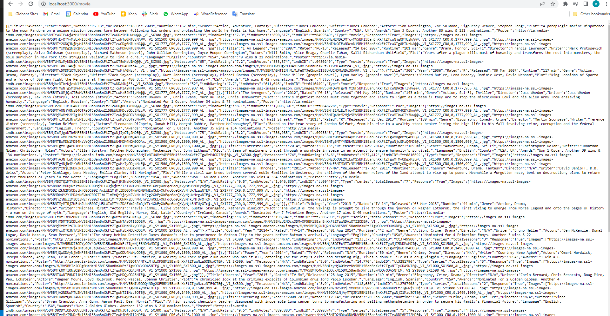
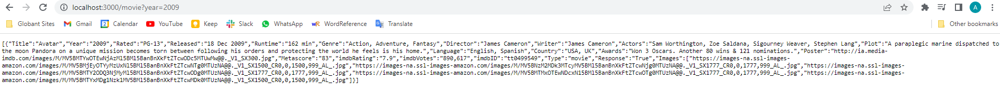

# technical-test-jj

> Technical code test of J&J.

[](https://github.com/google/gts)
[](https://github.com/prettier/prettier)
[]()

[Express](https://expressjs.com/) is a minimal and flexible Node.js web application framework that provides a robust set of features for web and mobile applications.

## How to execute the project?

```sh
npm install
npm start
```

## How to use?

For instance, in a explorer write the next steps:

- http://localhost:3000/movie



- http://localhost:3000/movie?year=2009



### Other general configurations:

- Google Typescript Style - GTS: Prettier and Eslint with some rules in 0 for nest. More information: .eslintrc.json
- Husky (Lite version): pre-commit and commit-msg: .husky and package.json